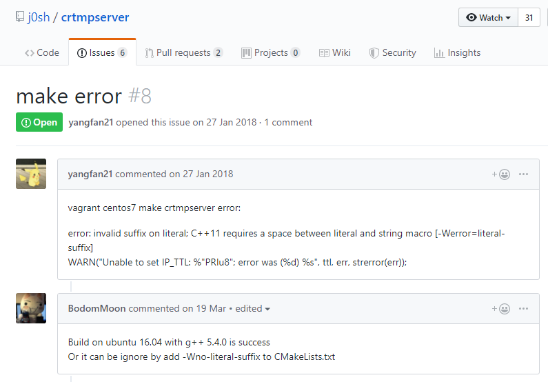

# Win10 WSL(Ubuntu 16.04)尝试安装gcc5.4.0+crtmpserver记录

## 一、安装WSL + 准备工作

控制面板 - 程序 - 启用或关闭Windows功能 - ✔适用于Linux的Windoews子系统

Microsoft Store - Ubuntu 16.04 LTS - 安装

开始 - Ubuntu 16.04 LTS - 设置用户名密码

`sudo -i` 开启root权限

配置清华mirror

```shell
wget https://tuna.moe/oh-my-tuna/oh-my-tuna.py
sudo python3 oh-my-tuna.py --global
apt-get update
```

```shell
mkdir install
cd install
```

下载gcc包，这里用hust的镜像源

`wget http://mirror.hust.edu.cn/gnu/gcc/gcc-5.4.0/gcc-5.4.0.tar.gz`

清华 https://mirrors.tuna.tsinghua.edu.cn/gnu/gcc/gcc-5.4.0/gcc-5.4.0.tar.gz

中科大 http://mirrors.ustc.edu.cn/gnu/gcc/gcc-5.4.0/gcc-5.4.0.tar.gz


## 二、安装gcc 5.4.0

### 踩坑之路开始

### 


```shell
tar zxvf gcc-5.4.0.tar.gz
cd gcc-5.4.0
./contrib/download_prerequisites
mkdir build
cd build

#这个版本必然会出现no acceptable C compiler found in $PATH
#所以在configure之前要安装gcc
#你没看错，安装gcc之前需要安装gcc...
apt-get install build-essential

/root/install/gcc-5.4.0/configure --prefix=/usr/local/gcc-5.4.0 --enable-threads=posix --disable-multilib --enable-languages=c,c++
#--prefix=/usr/local/gcc-5.4.0	指定安装路径
#--enable-threads=posix			使用POSIX/Unix98作为线程支持库
#--disable-multilib				取消多目标库编译(在64位系统中是取消32位库编译)
#--enable-languages=c,c++		支持的编程语言

make -j4
#再出错就 再见了您嘞
make install

```


## 三、安装crtmpserver

## 出错

#### 错误1

```shell
In file included from /root/install/gcc-5.4.0/libgcc/unwind-dw2.c:401:0:
./md-unwind-support.h: In function ‘x86_64_fallback_frame_state’:
./md-unwind-support.h:65:47: error: dereferencing pointer to incomplete type ‘struct ucontext’
       sc = (struct sigcontext *) (void *) &uc_->uc_mcontext;
                                               ^
/root/install/gcc-5.4.0/libgcc/shared-object.mk:14: recipe for target 'unwind-dw2.o' failed
make[3]: *** [unwind-dw2.o] Error 1
make[3]: *** Waiting for unfinished jobs....
make[3]: Leaving directory '/root/install/gcc-5.4.0/build/x86_64-unknown-linux-gnu/libgcc'
Makefile:19233: recipe for target 'all-stage1-target-libgcc' failed
make[2]: *** [all-stage1-target-libgcc] Error 2
make[2]: Leaving directory '/root/install/gcc-5.4.0/build'
Makefile:23131: recipe for target 'stage1-bubble' failed
make[1]: *** [stage1-bubble] Error 2
make[1]: Leaving directory '/root/install/gcc-5.4.0/build'
Makefile:910: recipe for target 'all' failed
make: *** [all] Error 2
```

解决：

在`build`路径下找到相应文件:

```shell
cd build/x86_64-pc-linux-gnu/libgcc
sudo vim md-unwind-support.h
```

修改61行:`struct ucontext *uc_ = context->cfa;`修改为`struct ucontext_t *uc_ = context->cfa;`
定义的结构体形式为:

```c
struct ucontext_t{};
```

ucontext.h

```c
extern int getcontext (ucontext_t *__ucp) __THROWNL;
```

#### 错误2

…/…/…/…/gcc-6.3.0/libsanitizer/sanitizer_common/sanitizer_stoptheworld_linux_libcdep.cc: 在函数‘int __sanitizer::TracerThread(void*)’中:
…/…/…/…/gcc-6.3.0/libsanitizer/sanitizer_common/sanitizer_stoptheworld_linux_libcdep.cc:270:22: 错误： 聚合‘sigaltstack handler_stack’类型不完全，无法被定义
struct sigaltstack handler_stack;

在路径:`gcc-5.4.0`下查找

```shell
cd libsanitizer/sanitizer_common
sudo vim sanitizer_stoptheworld_linux_libcdep.cc
```

修改xxx行:`struct sigaltstack handler_stack;`为`stack_t handler_stack;`
在路径:`gcc-5.4.0/`查找

```shell
cd libsanitizer/sanitizer_common
sudo vim sanitizer_linux.h
```

修改xx行和xx行:`uptr internal_sigaltstack(const struct sigaltstack* ss, struct sigaltstack* oss);`为`uptr internal_sigaltstack(const stack_t* ss, stack_t* oss);`

#### 错误3

…/…/…/…/libsanitizer/tsan/tsan_platform_linux.cc: In function ‘int __tsan::ExtractResolvFDs(void*, int*, int)’:
…/…/…/…/libsanitizer/tsan/tsan_platform_linux.cc:290:16: error: ‘statp’ was not declared in this scope

__res_state *statp = (__res_state*)state;
^~~~~
…/…/…/…/libsanitizer/tsan/tsan_platform_linux.cc:290:16: note: suggested alternative: ‘state’
__res_state *statp = (__res_state*)state;

在路径:`gcc-5.4.0`下查找

```shell
cd libsanitizer/tsan
sudo vim tsan_paltform_linux.cc
```

修改xxx行:`__res_state *statp = (__res_state*)state;`修改为`struct __res_state *statp = (struct __res_state*)state;`

